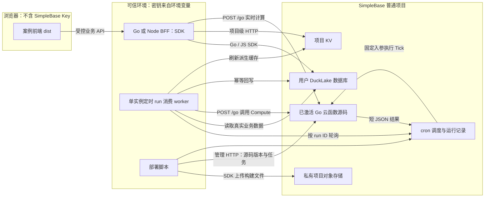
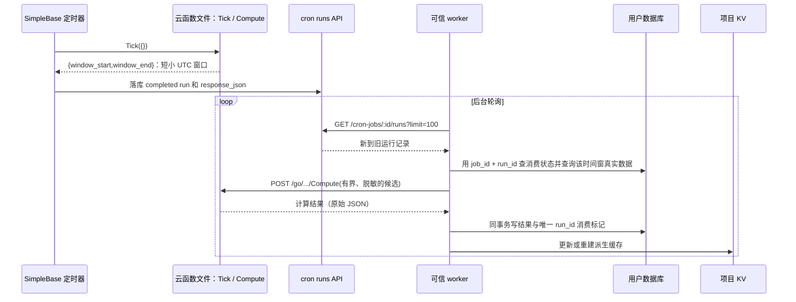

# examples 业务案例重构实施计划

> 状态：待实施；本文件只规划，不清空或修改 `examples/`。
> 范围：以约 5 个完整业务案例替换 `examples/browser-quickstart`、`examples/gofunction`、`examples/node-documents`、`examples/node-sql`、`examples/node-storage`。以 `docs/` 和当前实现为准，禁止把尚不存在的平台能力当成已上线功能。

## 1. 目标与边界

- 每个案例独立成目录，有可运行的可信后端（初始化 Go SDK 或 JS SDK）、可构建的前端、独立的 `package main` 单文件云函数源码、定时任务配置/部署脚本和从零运行说明；五个案例均展示**数据库、项目 KV、云函数、定时任务**的实际业务用途。对象存储负责前端构建产物上传，不与数据库持久层的 S3 混同。
- 运行顺序应可复现：创建普通项目及用户数据库 → 注入凭据 → 初始化业务表/集合和样例数据 → 运行可信服务 → 构建前端并上传产物 → 发布/试跑/激活云函数 → 创建定时任务 → 验证交互、运行记录和对象内容。
- **不新增第三方依赖、不修改 SDK/服务端协议或项目依赖清单**；案例需要依赖文件时仅使用仓库已有工具链/依赖，增量引入必须另行取得批准。业务数据、Key、构建物和产物不得提交到仓库。
- “先写 plan”是本次工作范围；实际删除旧示例和构建/上传/创建任务均留待下一阶段。清理前核对 `git status`、追踪文件与用户改动，保留压测历史用途或先迁移到专用压测目录并更新引用；不直接执行 `rm -rf examples`。现有 `plan/planv4.0/cleanup-plan.md` §E 将旧示例标作活跃资产，实施时须同步修订其防误删和验证描述。

## 2. 接口事实和前置决策

| 能力 | 当前可用路径 | 实施约束 |
| --- | --- | --- |
| 用户数据库 | JS `createClient(...).database(id).sql`，Go `gosdk.NewClient(...).Database(id).Query/Execute`；详见 `docs/database/index.md`、`docs/sdk/database-sql.md`、`docs/sdk/go-database-sql.md` | 用户库必须显式创建或提供 ID，不假设项目存在“第一个数据库”；SQL 参数化、初始化幂等，系统库禁止写入。 |
| 项目 KV | `POST /v1/projects/:projectId/kv`，`{"type":"cmd","argvs":[...]}`；详见 `docs/database/kv.md` | 目前 SDK 无 KV 专属方法：JS 可信端可用 `sb.raw.request`，Go 可信端用标准库 HTTP 小适配器；一次一条命令，返回 Redis 风格原始 JSON。路由目前统一要求 `database:write`，先验证只读 Key 场景，不依赖文档所写的读权限即可调用。 |
| 云函数 | 控制台或 `/v1/projects/:projectID/gofunctions` 管理端点；`POST /go/:projectID/:name/:functionName` 调用；详见 `docs/gofunction/overview.md`、`docs/gofunction/invoke.md` | 只提交单文件 Go **源码**；服务端解释器执行，不是 `go build` 的产物，不能在函数源码 import Go SDK/第三方包。导出函数签名必须为一个 JSON 可编解码参数、一个返回值；源码上限 256 KiB，运行上限 10 秒。 |
| 定时任务 | `/v1/projects/:projectID/cron-jobs`；详见 `docs/cronjob/overview.md` | 指向已激活函数；创建请求用 `schedule_kind`、`cron_expr`/`interval_seconds`/`run_at`、`func_file`、`func_export`、`input_json`（JSON **字符串**）。UTC 五字段 cron、执行 10 秒上限、失败不自动重试、重启最多补跑一次；任务须幂等。 |
| 前端产物 | JS `sb.storage.upload` / Go `client.UploadObject` 将 `dist` 上传项目对象存储；详见 `docs/sdk/storage.md`、`docs/sdk/go-storage.md` | 指定正确 HTML/JS/CSS MIME，路径和静态资源 base 正确；API 只提供私有对象上传/列表/预签名下载（15 分钟），**不提供网站域名、公开 GET、SPA fallback 或长期静态托管**。上传成功不等于网站上线。 |

**必须先解决的部署选择**：默认验收“构建前端 + 上传项目私有对象 + 校验对象清单/短期预签名下载”，前端本地通过静态服务器运行。若要达到“外网可访问的前端”，先确定独立的静态站点/CDN 托管及安全资源发布流程，单列部署手册和端到端验收；不能直接公开项目私有 S3 bucket，也不能依赖会过期的预签名链接加载整站。

**必须先解决的周期写入边界**：云函数当前只有受限的已注册标准库，`net/http` 可用，但没有注入项目级数据库/KV 客户端或安全凭据的约定。不得将持久写权限 Key 塞入云函数源码、`input_json`、前端或日志。默认方案是：云函数处理纯业务计算/规则并由定时任务运行，结果进入运行记录；由可信 Go/Node 服务读取运行记录、去重并经 SDK/HTTP 写回数据库与 KV（先核对运行记录响应及可安全消费的字段）。如果需要**云函数直接定时写入数据库/KV**，应先另立平台级凭据/受限能力设计及安全评审，不在本轮案例中假设其存在。

**身份模型**：浏览器不持任何 API Key，仅通过案例的可信后端 BFF 访问。BFF 在服务端读取环境变量，用 SDK 执行数据库和对象存储操作；KV、云函数、cron 管理端点由 BFF 的受控接口或部署脚本按需调用。BFF 必须验证调用方身份/授权并限制公开入口；演示本地开发可限制监听 `127.0.0.1`，生产部署前另行接入实际认证与限流。静态前端与 BFF 是两个部署目标，上传到对象存储不会自动部署 BFF。

### 2.1 部署架构（现有能力）



`Worker` 是可信 BFF 内部循环，不是现有 SimpleBase 的内建回写能力；静态前端本地运行或交由**另选**的站点托管提供，项目私有对象存储没有可用的公开网站路由。可信 BFF 不可仅因为前端已上传就宣称已部署；本地默认只监听 `127.0.0.1`，公网部署另需身份认证、授权、HTTPS、限流和 CORS/CSRF 设计。

### 2.2 周期任务闭环（解决固定输入问题）



Cron 的 `input_json` 是创建时**固定**的 JSON 字符串，无法自动查询实时业务库；所以每例函数文件包含 `Tick(req)`（只计算 UTC 已完成窗口）和 `Compute(req)`（对真实且有限的数据计算业务结果），cron 指向 `Tick`，worker 从 run 的 `response_json` 解析时间窗，查数据库后调用激活版本的 `Compute`。`Tick` 不产出业务聚合；不能以固定样本假装周期汇总。`response_json` 最多截断 4 KiB，设计成几十字节，并只消费 `completed` 且合法、属于该任务的 run。`Tick` 的时间包/JSON 用法先按 `gofunction/README.md` 及版本试跑验证。

Worker 每 10～30 秒按任务轮询、对可获取的 run 从旧到新处理，`job_id + run_id` 为唯一键；业务结果和消费标记写在**同一个数据库事务**，KV 为可重建缓存，提交后更新。KV 写入失败以数据库中 pending 标志重试，不重复业务写入；服务重启、重复 run、同窗不同 run 均须明确去重策略（窗口唯一业务键与 run 消费键分开）。运行记录最多返回 100 条且**没有游标分页**，若检测到追赶不及、4 KiB 截断或 JSON 非法，停止自动回写并告警，提供按时间窗从真实数据库重算/对账流程，不静默丢数据。定时任务失败不会自动重试，重启可能补跑一次。

### 2.3 关键接口细节

| 操作 | 请求 / SDK 调用 | 实现时必须校验 |
| --- | --- | --- |
| JS SDK 初始化 | 可信 Node `createClient({url,apiKey,projectId,databaseId})`；`client.database(id).sql.query/execute/batch` | 显式用户数据库 ID，不假设首库存在；SQL 用 `?` 参数；批处理检查返回的 `error` 和逐项 `error_code`，不只检查 HTTP 200。 |
| Go SDK 初始化 | `gosdk.NewClient(gosdk.Options{URL,APIKey,ProjectID,DatabaseID})`，`Database(id).Query/Execute/Batch` | Go 1.25+、根模块内导入 `github.com/linkxzhou/SimpleBase/packages/go-sdk`；Go Batch 显式传事务布尔值，检查 `BatchResult.Error`/逐项错误。 |
| KV | 可信 JS `sb.raw.request('POST', '/v1/projects/<id>/kv', {body:{type:'cmd',argvs:[...]}})`；Go 用标准库 `net/http` 小适配器 | SDK 无 KV 专用方法；命令一次一条，返回原始 Redis 风格 JSON（key miss 常为 `null`）。文档说读命令 `database:read`，实际 KV 路由要求 `database:write`，先实测权限。 |
| 创建/升级云函数 | `POST /gofunctions` `{name,source,activate:false}`；已存在则 `POST /gofunctions/:name/versions` `{source,activate:false}` | `activate` 省略时默认 **true**；从响应获取真实版本号，`POST .../:ver/test` 用 `{function_name:'Tick',body:{}}` 试跑检查 `ok`，再 `POST .../:ver/activate`；失败保留旧激活版。管理端点需 `database:write`。 |
| 调用函数 | `POST /go/:projectID/:name/:functionName`，JSON 入参 | 仅 POST，响应是原始 JSON，不含 `{data:...}`；调用权限 `database:read`；函数仅单源文件、已注册标准库、1 入参/1 返回，10 秒内完成。 |
| 创建/修改 cron | `POST /cron-jobs` `{name,schedule_kind:'cron',cron_expr:'0 1 * * *',func_file,func_export:'Tick',input_json:'{}',enabled:true}`；已有任务 `PATCH /cron-jobs/:jobID` | 激活函数后再创建；cron 统一 UTC 五字段，或 `interval_seconds` 60～2592000，或 RFC3339 `run_at`；`input_json` 是 JSON **字符串**且不超过 8 KiB。`POST .../trigger` 是异步 202，需轮询 `GET .../runs?limit=100` 并再次 JSON.parse `response_json`（它也是字符串）。 |
| 上传前端 | JS `sb.storage.upload(key,body,{contentType,filename})`；Go `client.UploadObject(ctx,key,reader,filename,contentType)` | 单文件约 50 MiB，上载 MIME 如 HTML `text/html`、JS `text/javascript`、CSS `text/css`；列表最多 1000 项。预签名短期 GET 只验证单对象，不作为整站 URL。 |

## 3. 五个案例的业务规格

每个目录采用统一结构（具体文件按实际实现最小化；不生成空目录）：

```text
examples/<case>/
  README.md                 # 环境、创建普通库、运行/部署/回滚、限制
  server/                   # JS createClient 或 Go gosdk.NewClient；BFF、worker、schema/seed、测试
  web/                      # 浏览器页面/入口、构建配置；只能请求受控 BFF
  functions/<case>.go       # 单文件 package main，导出 Tick / Compute
  deploy/                   # 前端上传、源码试跑激活、cron 幂等创建、冒烟/回滚
  package.json 或 Go 入口      # 按已有工具链和实际需要放置
```

JS 案例以 `file:../../packages/js-sdk` 引用**先构建**的仓库内 SDK（`docs/sdk/install.md`；按实际 `package.json` 相对路径调整）；Go 案例在根 Go 模块内导入 `github.com/linkxzhou/SimpleBase/packages/go-sdk`（`docs/sdk/go-install.md`），不另建 Go module。前端优先复用已安装的 Vite/TypeScript 构建工具，先以最小纵切验证从案例目录解析和输出是否可行，不改 `ui/package.json` / `packages/js-sdk/package.json`。`base` 用相对路径，保证构建后的静态资源可由本地静态服务器加载；TypeScript 对象形状统一用 `interface`，不新增 `any`。命名空间使用 `ex_<case>_` SQL 表/集合/函数/任务，`ex:<case>:` KV key，`<case>/<build-id>/` 对象键，避免同项目互相覆盖。

前端上传脚本以 `dist` 清单为输入，拒绝符号链接/路径穿越，逐文件指定 MIME（HTML `text/html; charset=utf-8`、JS `text/javascript`、CSS `text/css`、SVG `image/svg+xml`、JSON `application/json`；未知 `application/octet-stream`）；先资源后 `index.html`，核对上传文件清单/大小和至少两个对象下载内容。对象前缀使用不可变 build-id，不覆盖旧版；脚本持 Key 仅在可信环境运行，前端 bundle/`VITE_*` 均不含 Key。对象上传只能作为私有构建归档，本地静态服务或未来确定的公开托管负责页面访问。

| 案例目录 | SDK / 前端与 BFF 的业务 API | 数据库 + KV | 云函数与定时任务（真实数据闭环） |
| --- | --- | --- | --- |
| `examples/shop-service/` 商城订单 | JS SDK；商品页/购物车/下单/订单页；BFF `GET /api/products`、`PUT /api/cart`、`POST /api/orders`、`GET /api/orders/:id`；产物 `shop-service/<build-id>/` | SQL `ex_shop_products`、`ex_shop_orders`、`ex_shop_order_items`、`ex_shop_daily_stats`（窗口唯一）；KV `ex:shop:cart:<session>` HASH+TTL、热销列表缓存 | `ex_shop_metrics.go`：`Tick` 返回上个 UTC 自然日，`Compute` 接受脱敏 `sku/qty/amount_minor` 聚合；`ex_shop_daily` 用 `0 1 * * *`，worker 查真实订单、按窗口幂等落库并重建 KV。 |
| `examples/mini-game-service/` 小游戏 | Go SDK；可玩的本地计时/答题、结算/排行榜；BFF `GET /api/levels`、`POST /api/sessions`、`POST /api/scores`、`GET /api/leaderboard` | SQL `ex_game_players`、`ex_game_levels`、`ex_game_scores`（session_id 唯一）、`ex_game_seasons`；KV `ex:game:session:<id>` 带 TTL、排行榜 ZSET | `ex_game_season.go`：`Tick` 返回上个 UTC 小时，`Compute` 对有限的脱敏玩家积分稳定排序；`ex_game_rank_refresh` 每小时执行，worker 按真实成绩汇总玩家数据，生成赛季快照与缓存。 |
| `examples/booking-service/` 预约服务 | JS SDK；时段/暂留/确认/取消；BFF `GET /api/slots`、`POST /api/holds`、`POST /api/bookings`、`DELETE /api/bookings/:id` | SQL `ex_booking_slots`、`ex_booking_reservations`（用唯一约束/条件更新防超卖）、`ex_booking_cleanup_runs`；KV `ex:booking:hold:<token>` TTL、时段缓存 | `ex_booking_expiry.go`：`Tick` 返回已完成的 UTC 分钟窗，`Compute` 接受有界候选 ID/过期时间并返回过期 ID；`ex_booking_expired` 每 5 分钟执行，worker 按真实库复查状态后条件更新、释放派生缓存。 |
| `examples/community-service/` 内容社区 | Go SDK；发动态、浏览、点赞、热榜；BFF `GET /api/posts`、`POST /api/posts`、`POST /api/posts/:id/likes`、`GET /api/trending` | 显式用户库文档集合 `ex_community_posts`，SQL `ex_community_likes`（actor_id/post_id 唯一）、`ex_community_trending`；KV `ex:community:post:<id>` 和热榜缓存 | `ex_community_trending.go`：`Tick` 返回上个 UTC 小时，`Compute` 对有限 `post_id/like_count/age_minutes` 计算热度；`ex_community_hot` 每小时运行，worker 核实文档仍存在后落榜单。跨文档/SQL 原子性须实测并提供不一致修复。 |
| `examples/ticket-service/` 工单服务 | JS SDK；建单、推进状态、超期视图；BFF `GET /api/tickets`、`POST /api/tickets`、`PATCH /api/tickets/:id`、`GET /api/overdue` | SQL `ex_ticket_tickets`、`ex_ticket_events`（同事务推进）、`ex_ticket_sla_marks`；KV `ex:ticket:idem:<key>` TTL 与待办缓存 | `ex_ticket_sla.go`：`Tick` 返回已完成 UTC 小时窗，`Compute` 计算脱敏工单 `ticket_id/status/due_at/priority` 的 SLA 级别；`ex_ticket_sla_scan` 每小时运行，worker 复查最新状态后标记并刷 KV。 |

共性：BFF 必须校验业务身份和请求大小；演示本地单用户不代表可公开部署。金额用最小货币单位整数，时间 UTC，所有写 SQL 参数化；业务写入的最终幂等由数据库唯一键/事务保证，KV 只是临时态或派生缓存。`Compute` 输入大小和实例请求体上限须实测，大数据按时间窗与数据分页汇总成有界脱敏输入，不允许超出限制后默默截断。商城库存并发、预约容量、游戏反作弊和文档/SQL 跨模型一致性分别给出集成测试与 README 限制，不宣称未验证的生产保证。

## 4. 实施里程碑与退出条件（下一阶段）

| 阶段 | 实现任务 | 退出条件 / 失败处理 |
| --- | --- | --- |
| P0 基线和迁移 | 列出旧 `examples/` 的追踪文件、未提交改动、测试/文档/CI 引用；决定 `examples/gofunction` 压测资产迁至非业务目录并更新入口，旧 Node smoke 样例用新案例替代后才清理。 | `git diff` 无用户工作被覆盖、旧压测基准在迁移后仍能运行；**不**先 `rm -rf examples`。新案例未完成前保持原样。 |
| P1 商城纵切 | 在普通用户库写幂等 schema/seed；初始化 JS SDK、BFF、KV 适配、业务页，先写库存/幂等/越权/TTL 单测；检查 `ui` 已装构建工具可否跨目录构建 web。 | 本地 BFF+web 可运行；不含 Key 的 bundle；SQL 批处理失败会显式报错；未证实库存并发安全则限制为单写演示。 |
| P2 云函数版本闭环 | 写 `package main` 单文件 `Tick`/`Compute`，分别用代表性时间窗和业务样本试跑；部署脚本先 GET 函数、按源码差异创建/复用，**显式** `activate:false` → `test` → `activate` → `/go` 冒烟。 | 任一试跑/调用失败则**不激活**新版本/不创建 cron；旧激活版仍可调用；不猜返回的版本号。 |
| P3 cron 和 worker | 创建前 GET 同名任务；不存在 POST，存在仅在配置变化时 PATCH（保留任务 ID）；手动触发 202 后轮询 `runs`，检查 `completed` 与可解析短 JSON；实现真实 DB 取数、调用 Compute、run 唯一消费标记和 KV 失败恢复。 | 重复部署不增加任务数；重放相同 run 或重启 BFF 不重复计数；停 worker 会告警且不会伪造成功；超过 100 条 run 不被静默遗漏。 |
| P4 扩展另外四例 | 按 §3 分别开发/测试；两个 Go 案例实测标准库 KV HTTP 适配和 Go SDK，三个 JS 案例实测 `raw.request`。命名空间隔离。 | 五例各自从空普通库重放初始化与业务路径，云函数/cron 真实运行；Go 服务可 `go build`，但不把二进制当云函数上传。 |
| P5 构建/上传 | 本地先构建 JS SDK；web 配相对 `base` 构建；SDK 上传所有 `dist` 文件到 `<case>/<build-id>/`，先资源后首页，核对 MIME、列表、大小/内容和短期预签名下载。 | 上传与本地预览通过；若网站托管未另行落地，验收状态写“**私有产物上传成功，公开网站未交付**”。 |
| P6 文档与清理 | 每例 README 给出 `SIMPLEBASE_URL`、`SIMPLEBASE_PROJECT_ID`、`SIMPLEBASE_DATABASE_ID`、`SIMPLEBASE_API_KEY` 的设置与最小权限、数据库创建、构建/运行/部署/回滚命令；更新旧引用、`cleanup-plan.md` §E；KV 权限不一致先实测再修文档。 | 新手可按 README 在本地从零重现；`go test ./...` 和既有 SDK 测试通过；旧示例仅在等价能力被新例覆盖且压测已迁移后删除。 |

### 4.1 发布顺序与可恢复步骤

1. **初始化**：手动/可信程序在普通项目创建用户库，导出显式 DB ID；拒绝 admin 系统项目。初始化表/集合/固定模拟数据（幂等，禁止自动删除生产数据）。密钥仅从可信环境读取，缺值即失败；真实生产数据绝不当 seed。
2. **验证后端**：Go SDK 需要 Go 1.25+ 和根模块；JS SDK 按 `docs/sdk/install.md` 构建，本地 `file:` 引用。BFF 默认环回地址；写路径只允许受控的演示用户，不提供匿名公网入口。先完成测试再开放前端交互。
3. **上传源码**：管理端点 `POST /v1/projects/:p/gofunctions` 或 `.../:name/versions` 提交 `source` 字符串和 `activate:false`。拿到服务端返回的版本，分别对 `Tick` 和 `Compute` 调 `POST .../:ver/test`（请求 `{function_name,body}`，需要检查响应 `ok` 与 `status_code`），成功才激活，并以 `/go/:p/:name/Compute` 验证原始 JSON。
4. **配置调度**：目标版本激活后创建/更新同名 cron，先以 `enabled:false` 建立并手动触发验证（需实测停用任务能否手动触发；不支持则改成短时启用并防止首轮并发），`input_json:'{}'`；测试完成后明确启用。配置 UTC cron 时分；幂等脚本对已存在任务使用从 GET 结果获得的 ID 和 PATCH，不直接重复 POST。
5. **前端部署**：使用例子自身的 `build` 命令产出 `dist`，逐文件 SDK 上传到唯一 build-id 前缀；不直接改 bucket ACL、不改 `internal/web/dist`。验证对象清单与预签名的单文件内容；本地静态服务加载本地 `dist`，检查页面资产与 BFF 通信。
6. **回滚**：先停用 cron 与 worker，重新激活记录的旧函数版本，再恢复旧配置/旧 BFF；仅删除明确的本次 build-id 对象清单，不删除整个项目/库；业务库只做受控的案例数据清理，不自动破坏生产数据。若只上传资源部分失败，不发布首页且保留旧 build；若 worker 消费失败，保留未成功的 run 待修复后重放。

### 4.2 测试优先级与可追溯检查

- **单测**：入参白名单、权限校验、SQL 参数绑定、KV miss/TTL、无 Key bundle、云函数纯计算窗口/边界、MIME 映射/路径穿越拒绝、部署脚本检查 `activate:false` 与幂等配置；Go `go test`，JS 使用仓库已有测试工具，不新增包。
- **集成**：从干净的普通项目/数据库初始化；商品重复下单与库存、游戏重复结算、预约并发抢号、社区重复点赞和跨模型修复、工单版本冲突；各例同时测试 run 重放、同窗不同 run、KV 刷新失败、BFF 重启/追赶与大输入拒绝。
- **端到端**：`POST .../trigger` 返回 202 后轮询 run 为 completed，确认解析真实 `response_json` → 真数据查库 → `Compute` → SQL 持久化 → KV 查询可见；前端构建物上传 MIME/清单/内容核对；实际公开托管如未选择，明确标为未验收。
- **回归**：`go build ./internal/... ./cmd/...`、`go test ./...`、`go test ./gofunction/... -short`、`go test ./packages/go-sdk`；`cd packages/js-sdk && npm run typecheck && npm test`；五例执行各自 README 明示的 build/test 命令。缺服务实例/S3 环境时将集成测试标为**未验证**，不能宣称通过。

## 5. 验收标准与验证命令

- 每例从干净项目按 README 操作：后端可启动、前端可构建并本地访问，数据库数据与 KV TTL/查询可复现；用例有业务测试（成功、非法输入、重复操作、失效令牌/幂等）和无 Key 泄漏检查。
- 每例至少一个版本可试跑、可激活、可正式调用；cron 目标是已激活函数，手动触发后在 runs 中看到结果；可信服务从**真实本轮运行记录**安全消费、去重并持久化，失败和 10 秒/8 KB/4 KB 边界有可观察的处理。
- 每例的 `dist` 上传到独立项目对象前缀，验证 HTML/JS/CSS MIME、文件清单与短期预签名下载；**不将“对象上传”计为“公开网站上线”**。生产外网访问必须在独立托管方案落地后单独验收。
- 所有密钥只存在可信环境；不可提交密钥或业务样本中的隐私数据，不向浏览器暴露写权限 Key；回滚可停用任务、切换云函数旧版本及按前缀清理对象，而不删除整项目。
- 改动完成后运行：`go build ./internal/... ./cmd/...`、`go test ./...`、`go test ./gofunction/... -short`、`go test ./packages/go-sdk`；`cd packages/js-sdk && npm run typecheck && npm test`；针对每个 Go/JS 案例运行其 README 明示的构建和测试命令，并至少在本地 SimpleBase 实例执行一次冒烟全链路。未配置实例/S3 时将线上集成验收标为未验证，不伪称通过。

## 6. 风险与回退

- 无公开站点服务、无函数内安全凭据注入是产品边界，不能靠公开 bucket 或硬编码 Key 绕过；不满足部署选择时只交付私有对象上传与本地运行。
- `docs/database/kv.md` 写读命令需 `database:read`，实际 KV 路由统一要求 `database:write`；验收前通过权限测试锁定行为并修正文档或服务端，暂用可信后端持必要权限。
- 云函数的单文件/标准库限制、cron 固定输入和运行结果大小意味着“实时定时聚合”必须明确可信服务的取数/传入/消费步骤；超过限制时缩小业务范围或先单独设计平台能力，不留下静默失效的案例。
- 删除旧示例可能影响 `go test ./...`、压测入口、清理计划和旧路径引用；先迁移仍需保留的压测代码，再逐条更新引用，失败时从版本控制恢复旧示例，不修改 SDK/服务端以掩盖案例缺陷。
